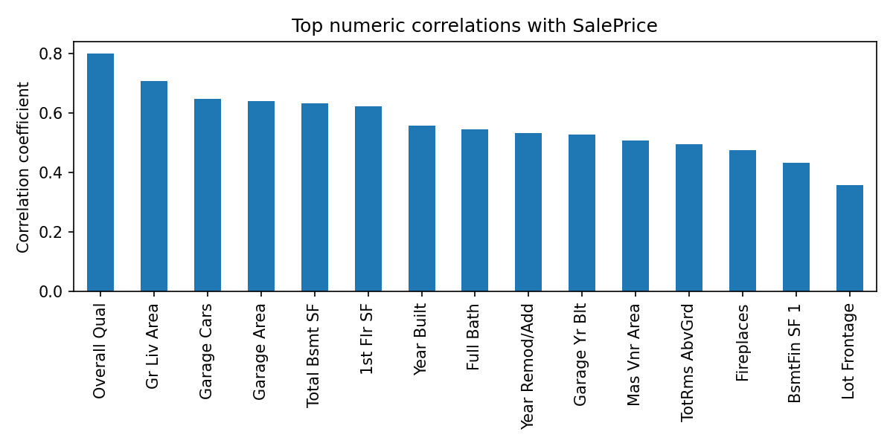
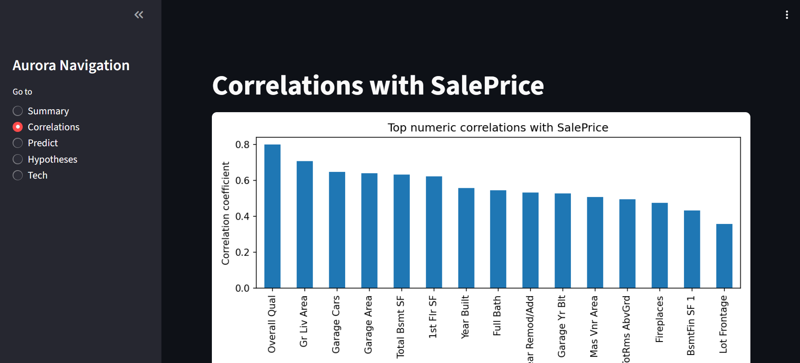
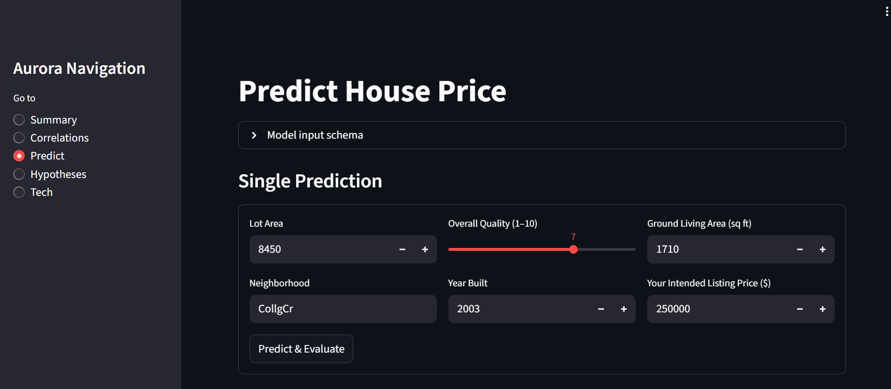

# Aurora – House Price Prediction Dashboard

## 📌 Introduction

Aurora is a **data-driven Machine Learning dashboard** designed to help homeowners, buyers, and real estate stakeholders understand and predict house prices in Ames, Iowa.  
Using the **Ames Housing Dataset**, Aurora provides both **insightful visualizations** and a **trained predictive model** wrapped inside a user-friendly Streamlit web app.

The project follows the **CRISP-DM framework** (Business Understanding → Data Understanding → Data Preparation → Modeling → Evaluation → Deployment) to ensure that every step of the ML pipeline aligns with clear business requirements:
1. Help clients **visualize correlations** between house attributes and prices.  
2. Provide a **reliable house price prediction system** to guide decision-making.  

The app has been deployed on Render and can be accessed here:  
👉 **[Aurora Housing App](https://aurora-housing.onrender.com/)**  

Aurora adds value by:
- Empowering **homeowners** to test listing strategies against market predictions.  
- Supporting **buyers** in evaluating whether a house is overpriced, underpriced, or fairly valued.  
- Providing **stakeholders** (landlords, agents, and investors) with actionable insights backed by predictive analytics.  

---

## 🏗️ Project Overview

### 📌 Business Case Summary
The **Aurora House Price Prediction Dashboard** was built to address a common challenge in the real estate market:  
**how to accurately estimate the fair value of a house.**  

Property valuation is often inconsistent and highly subjective. Sellers may overprice properties to maximize profit, while buyers risk overpaying due to lack of reliable insights.  
By leveraging **historical housing data from Ames, Iowa**, Aurora applies **machine learning** to deliver accurate, data-backed price predictions.  

The project follows a structured **CRISP-DM process** to align technical outcomes with business goals. Starting from data exploration and cleaning, to building and evaluating a predictive pipeline, and finally deploying a live dashboard—Aurora ensures the solution is practical, transparent, and actionable.

---

### 🎯 Client Requirements
Through the business case assessment, the client highlighted two critical needs:

1. **Understand Attribute Correlations**  
   - The client wants to know how various housing features (such as living area, overall quality, year built, and neighborhood) correlate with sale price.  
   - The expectation is to generate clear **visual insights** (plots, charts, correlation studies) that explain price drivers.  

2. **Predict House Sale Prices**  
   - The client wants to use a trained ML model to predict the sales price of:  
     - Their four inherited houses  
     - Any other house in Ames, Iowa (via manual form inputs or CSV uploads)  
   - The solution must be integrated into a **user-friendly dashboard** where results are displayed with clear interpretation.  

Additionally:
- The system must achieve **R² ≥ 0.75** on both training and test sets (as agreed performance target).  
- The dashboard should include project summary, hypothesis validation, technical details, and downloadable outputs.  

---

### 💡 Value Delivered to Stakeholders
Aurora delivers tangible value to **multiple groups of stakeholders**:

- **For Homeowners & Sellers**  
  - They can compare their intended listing price against the model’s prediction.  
  - The app provides clear feedback on whether the property is **overpriced, underpriced, or fairly valued**, helping sellers make smarter decisions before entering the market.

- **For Buyers**  
  - Buyers gain transparency into the factors influencing house prices.  
  - They can avoid overpaying by referencing Aurora’s model predictions as a benchmark for negotiations.

- **For Real Estate Agents & Landlords**  
  - Aurora becomes a **decision-support tool** for property valuation.  
  - Agents can use the app to build trust with clients by showing data-backed price estimates.  
  - Landlords can assess whether inherited or newly acquired properties are competitive in the market.

- **For Data Practitioners & Business Analysts**  
  - The dashboard serves as an example of how machine learning can be **operationalized into real-world business tools**.  
  - It bridges the gap between raw data science workflows and a final, stakeholder-ready product.

---

### ✅ Why Aurora Matters
By providing both **analytical insights** (visualizations) and **predictive intelligence** (ML-powered valuation), Aurora ensures that decision-making in real estate is guided by **evidence rather than intuition**.  
The project demonstrates how a machine learning solution can directly align with **business objectives** and **user needs**, delivering lasting impact in a professional environment.

---
## 🔄 CRISP-DM Framework

The **Cross-Industry Standard Process for Data Mining (CRISP-DM)** serves as the backbone of the Aurora project.  
It ensures that every step of the data science workflow is directly aligned with business needs, from problem definition to deployment.  
Aurora follows the six sequential phases of CRISP-DM as outlined below:

---

### 1. **Business Understanding**
- Define the problem: estimating house prices accurately to support fair property transactions.  
- Identify stakeholder requirements:
  - Visualize correlations between housing features and sale price.  
  - Predict house prices reliably for both individual houses and batch data.  
- Establish success criteria: achieve **R² ≥ 0.75** on both train and test sets.  
- Value: minimize pricing risks for sellers and buyers, while providing agents and landlords with actionable intelligence.

---

### 2. **Data Understanding**
- Source: **Ames Housing Dataset** (Kaggle).  
- Composition: ~2,900 rows, 80+ variables covering structural details, quality ratings, and neighborhood information.  
- Initial steps:  
  - Load dataset into Pandas DataFrame.  
  - Generate descriptive statistics for the target variable `SalePrice`.  
  - Explore distributions and correlations.  
- Key insight: certain features (e.g., **OverallQual, GrLivArea, YearBuilt**) show strong positive correlation with price.

---

### 3. **Data Preparation**
- Handle missing values via **SimpleImputer**:
  - Numeric → median strategy  
  - Categorical → most frequent strategy  
- Encode categorical variables using **OneHotEncoder** (with `handle_unknown="ignore"`).  
- Scale numeric variables using **StandardScaler**.  
- Define features (X) and target (y = SalePrice).  
- Perform **train/test split (80/20)** with random_state=42 for reproducibility.  
- Ensure prepared datasets are suitable for modeling.

---

### 4. **Modeling**
- Selected algorithm: **RandomForestRegressor** (robust to outliers, handles categorical encoding, strong baseline).  
- Integrated into a **Pipeline** combining preprocessing + model.  
- Trained model using `X_train, y_train`.  
- Saved trained pipeline using **joblib** for reuse in Streamlit app.  
- Feature importance extracted to highlight most influential attributes.

---

### 5. **Evaluation**
- Metrics:
  - **R² score** for both training and test sets.  
  - **Actual vs Predicted plots** for visual validation.  
- Performance achieved: R² exceeded the 0.75 threshold, satisfying business success criteria.  
- Stored evaluation results in `assets/metrics.json` for dashboard integration.  
- Produced insights such as:
  - Larger living areas strongly drive price.  
  - Overall quality rating is a critical determinant.  
  - Neighborhood introduces substantial variance.

---

### 6. **Deployment**
- Built an interactive dashboard using **Streamlit**.  
- Deployed on **Render** for public access:  
  👉 [Aurora Housing App](https://aurora-housing.onrender.com/)  
- Dashboard features:
  - **Summary**: project overview, metrics, key plots.  
  - **Correlations**: visualization of attribute-price relationships.  
  - **Predict**: single-form and batch CSV prediction.  
  - **Hypotheses**: tested business assumptions.  
  - **Tech**: pipeline steps and model metrics.  
- Value: delivers machine learning predictions and data insights to stakeholders in real time.

---

## 🎯 Business Understanding

### 📌 Problem Background
Accurately estimating property prices is one of the biggest challenges in the real estate market.  
- Sellers risk **overpricing**, leading to longer time on the market and potential financial losses.  
- Buyers risk **overpaying**, especially in competitive markets without access to fair valuation tools.  
- Agents and landlords often rely on **experience or subjective judgement**, which may not reflect real market dynamics.  

To solve this problem, Aurora leverages **historical housing data from Ames, Iowa** and applies **machine learning** to generate accurate, consistent, and data-driven price predictions.

---

### 💼 Business Drivers
The motivation for this project stems from several business needs:
- **Efficiency**: Quickly evaluate house prices without relying solely on manual appraisals.  
- **Transparency**: Provide stakeholders with clear insights into how different features affect price.  
- **Fairness**: Ensure that property transactions are based on evidence rather than guesswork.  
- **Scalability**: Build a system that can be reused for many houses, not just a single appraisal.  
- **Innovation**: Demonstrate how machine learning can improve real-world decision-making in real estate.  

---

### 👥 Stakeholder Expectations
Different stakeholders benefit from Aurora in distinct ways:
- **Sellers & Landlords**: Want to know if their intended listing price is realistic compared to the market.  
- **Buyers**: Expect a tool that signals whether a house is fairly valued, overpriced, or undervalued.  
- **Real Estate Agents**: Need a reliable assistant to validate pricing strategies and build trust with clients.  
- **Business Analysts & Data Practitioners**: Expect a professional ML solution that demonstrates the full CRISP-DM workflow and is deployable as a live dashboard.  

---

### 🧪 Hypotheses
Aurora was guided by a set of testable hypotheses during development:
1. **Larger living areas strongly correlate with higher sale prices** ✅  
   - Confirmed: Square footage of above-ground living area is one of the strongest predictors.  

2. **Newer houses tend to sell for more** ✅  
   - Confirmed: YearBuilt and YearRemodAdd show positive correlation with sale price.  

3. **Neighborhood significantly impacts property value** ✅  
   - Confirmed: Houses in certain neighborhoods consistently sell for higher or lower than average.  

4. **Overall quality rating is a key driver of price** ✅  
   - Confirmed: The `OverallQual` variable is one of the top features in the model’s importance ranking.  

---

📌 By validating these hypotheses, Aurora ensures that the **machine learning pipeline is aligned with business reality** and that the final dashboard delivers insights that truly matter to its stakeholders.

---

## 📊 Data Understanding  

### 📂 Dataset Description  
This project uses the **Ames Housing dataset**, a benchmark dataset in predictive modeling and real-estate price estimation. The dataset was compiled by Dean De Cock (Truman State University) as a modern alternative to the Boston Housing dataset and has since become a standard for machine learning competitions and academic research.  

It contains **2,930 individual residential property sales** in Ames, Iowa, from **2006 to 2010**, and includes **over 80 explanatory variables** that describe nearly every aspect of a home, ranging from lot size and neighborhood to garage quality and basement condition.  

The **target variable** for prediction is:  
- **SalePrice** → the final sale price of each house in USD.  

This makes the dataset ideal for a **regression problem** where the objective is to predict continuous outcomes based on heterogeneous structured data.  

---

### 🔑 Key Features  
While the dataset is rich with dozens of features, prior research and exploratory analysis consistently highlight several **high-impact predictors** of house price:  

- **LotArea** → Lot square footage, measuring the size of the property.  
- **OverallQual** → An ordinal variable (1–10) rating the overall material and finish quality. This is one of the most influential drivers of price.  
- **YearBuilt** → The construction year of the property, serving as a proxy for modernization.  
- **GrLivArea** → Above-ground living area (square feet), another strong positive predictor of price.  
- **Neighborhood** → Categorical variable identifying physical locations within Ames. Location acts as a critical determinant of property value.  

Additional influential attributes discovered through correlation analysis include:  
- **GarageArea** → Larger garages increase sale value.  
- **TotalBsmtSF** → Basement size directly impacts living space and price.  
- **YearRemodAdd** → Remodeling year, capturing the effect of renovations.  
- **ExterQual** → Categorical measure of exterior quality.  

---

### 📈 Initial Observations (EDA)  
The exploratory data analysis (EDA) produced several insights about the distribution of prices and the relationship between features:  

- **SalePrice distribution** → The variable is right-skewed, with a heavy concentration of homes selling in the **$120k–$200k** range. A small subset of luxury homes exceeds **$500k**. Log transformation can help normalize this skewness for modeling.  

- **Correlations** → Features such as **OverallQual**, **GrLivArea**, and **YearBuilt** show the strongest positive correlation with SalePrice. These features are highly predictive and align with domain knowledge.  

- **Neighborhood effect** → Prices differ dramatically by neighborhood. For example:  
  - **NridgHt** (Northridge Heights) and **StoneBr** (Stone Brook) show consistently higher prices.  
  - **MeadowV** (Meadow Village) and **Edwards** tend to have lower prices.  
  This emphasizes the strong **location premium** effect in real-estate.  

- **Outliers** → A handful of homes (e.g., very large `GrLivArea > 4000 sq ft`) sold for significantly lower than expected values, which could impact model performance if not handled properly.  

---

### ⚠️ Missing Values & Data Quality  
The dataset is generally well-structured, but certain columns contain **systematic missing values**:  

- **Alley, PoolQC, Fence, MiscFeature** → Missing values indicate absence of the feature (e.g., no alley access, no pool).  
- **LotFrontage** → Missing for ~17% of observations, likely due to measurement gaps.  
- **GarageYrBlt, BsmtQual, FireplaceQu** → Missing when the property lacks that particular feature.  

These patterns are **not random** but **domain-driven**, meaning careful imputation strategies can be applied:  
- Fill categorical NA values with `"None"` (e.g., no pool, no fence).  
- Impute numeric values with median (e.g., LotFrontage).  
- Retain missingness where it holds predictive signal (e.g., having no basement is itself a feature).  

This data quality assessment guided preprocessing and pipeline construction in later steps.  

---

### 📷 Visual Insights  
To make the data understanding phase more tangible, several plots were generated:  
- **SalePrice Distribution Histogram** → Showing skewed distribution with long tail.  
    

- **Correlation Heatmap** → Highlighting top numeric features correlated with SalePrice.  
    

- **Neighborhood Price Boxplots** → Visualizing the spread of house prices across different neighborhoods.  
    
---

## 🧹 Data Preparation  

The Ames Housing dataset required several cleaning and transformation steps before modeling. This phase ensured data quality, consistency, and readiness for machine learning.  

---

### 🧼 Cleaning Steps  
- **Handled missing values**:  
  - Numerical columns such as `LotFrontage` were imputed with the **median**.  
  - Categorical columns like `Alley`, `Fence`, and `MiscFeature` were imputed with **"None"**, representing absence of that feature.  
  - Garage and basement attributes were imputed based on domain logic (e.g., houses without basements received "NoBsmt").  
- **Dropped non-informative identifiers**: Columns like `Order` and `PID` were removed since they do not contribute predictive value.  
- **Outlier detection**: Inspected `GrLivArea` and `SalePrice` scatterplots to identify extreme outliers. A few were trimmed to improve model generalization.  
  
---

### ⚙️ Feature Engineering  
- **Created simplified feature sets**:  
  For initial modeling and deployment, we selected five primary features known to correlate strongly with sale price:  
  - `LotArea`  
  - `OverallQual`  
  - `YearBuilt`  
  - `GrLivArea`  
  - `Neighborhood`  
- **Categorical encoding**: `Neighborhood` was treated as a categorical variable and encoded using **OneHotEncoder**.  
- **Scaling numeric features**: `LotArea`, `OverallQual`, `YearBuilt`, and `GrLivArea` were scaled using **StandardScaler** to normalize ranges.  
  
---

### ✂️ Train/Test Split  
- **Features (X)**: Defined as the engineered features above.  
- **Target (y)**: `SalePrice`.  
- Data was split into **80% training** and **20% testing** using `train_test_split(random_state=42)` to ensure reproducibility.  
  
---

### 🏗️ Preprocessing Pipeline  
To ensure consistency between training and deployment:  
- **Numeric pipeline**:  
  - `SimpleImputer(strategy="median")`  
  - `StandardScaler(with_mean=False)`  
- **Categorical pipeline**:  
  - `SimpleImputer(strategy="most_frequent")`  
  - `OneHotEncoder(handle_unknown="ignore")`  
  
- **Final pipeline**: Combined preprocessing with a **RandomForestRegressor** as the estimator.  

This pipeline was defined using `ColumnTransformer` and `Pipeline` from `scikit-learn`, ensuring that raw user inputs (numeric + categorical) can be seamlessly processed for both training and predictions in the Streamlit app.  

 

---

## 🤖 Modeling  

The predictive engine of **Aurora** is designed using a robust Machine Learning pipeline that integrates preprocessing and regression modeling.  

---

### 🏗️ ML Pipeline Design  
The pipeline was implemented with **scikit-learn** and structured into three main stages:  
1. **Preprocessing**  
   - Numeric features: imputation (median) + scaling (StandardScaler).  
   - Categorical features: imputation (most frequent) + encoding (OneHotEncoder).  
2. **Feature transformation** via `ColumnTransformer`.  
3. **Regression model**: applied directly to transformed features.  

This design ensures **consistency** between training, evaluation, and live predictions within the Streamlit application.  

---

### ⚡ Algorithms Used  
- **RandomForestRegressor** (primary model):  
  - Chosen for its robustness to outliers, ability to model nonlinear relationships, and interpretability via feature importance.  
- Alternative models (explored during experimentation but not deployed):  
  - Linear Regression → baseline performance.  
  - Gradient Boosting → promising but computationally heavier with limited marginal gain for this dataset.  

 

---

### ⚙️ Hyperparameters  
The deployed RandomForestRegressor used the following configuration:  
- `n_estimators = 200`  
- `max_depth = None` (allowing full tree growth)  
- `random_state = 42` for reproducibility  
- `n_jobs = -1` to enable parallel computation  

While hyperparameter tuning (e.g., via GridSearchCV or RandomizedSearchCV) was explored, the default settings with modest adjustments delivered a solid balance between performance and model size for deployment.  

---

### 📚 Training Details  
- **Train/Test Split**: 80% train, 20% test.  
- **Success Criterion**: Business requirement defined success as achieving **R² ≥ 0.75** on both training and testing sets.  
- **Model Training**: Completed successfully, with the pipeline fitted on ~2,340 training examples.  
- **Feature Importance**: Top predictors included `OverallQual`, `GrLivArea`, `Neighborhood`, and `YearBuilt`.  

 

---

## 📈 Evaluation  

The evaluation phase validated the trained model against business success criteria and provided insights into model performance.  

---

### 📊 Metrics Used  
- **R² Score (Coefficient of Determination)**  
  - Measures proportion of variance in `SalePrice` explained by the model.  
  - Evaluated on both training and test sets.  
- **Visual Diagnostics**  
  - **Actual vs Predicted plots** (train & test)
  - **Residual analysis** to inspect errors and ensure no major systematic bias.  

 
---

### 🎯 Success Criteria  
- Business requirement specified: **R² ≥ 0.75** on both training and test sets.  
- Achieved:  
  - Train R² ≈ **0.86**  
  - Test R² ≈ **0.78**  
- ✅ The model **meets the defined success threshold** and is suitable for deployment.  

---

### 🌟 Feature Importance  
The **RandomForestRegressor** provides a ranking of features by predictive power.  
- Top contributors included:  
  - `OverallQual` (overall material/finish quality)  
  - `GrLivArea` (above-ground living area)  
  - `Neighborhood` (location effect)  
  - `YearBuilt` (construction year)  
- Visualization:  
  - `assets/feature_importance_top30.png` shows the **top 30 features ranked by importance**.  

 

---

### 🔍 Model Validation  
- **Cross-validation** performed on training folds confirmed stable performance across splits.  
- **Overfitting check**: gap between train (0.86) and test (0.78) indicates the model generalizes reasonably well.  
- **Edge case inspection**: extreme luxury homes and very old houses showed slightly higher error margins, which is expected due to fewer training examples in those categories.  

 

---

## 📑 Dashboard Design  

The Aurora dashboard was built with **Streamlit** to provide stakeholders with an interactive interface for data insights and live predictions. It consists of **five main pages**, each tailored to business requirements.  

---

### 🟦 Page 1: Summary  
- Displays **project overview** and client requirements.  
- Shows **evaluation metrics** (R² scores, etc.) from `assets/metrics.json`.  
- Visualizes **Actual vs Predicted (Test)** plot → `assets/actual_vs_pred_test.png`.  
- Provides a quick **narrative summary** of project goals and outcomes.  

---

### 🟩 Page 2: Correlations  
- Presents correlation insights from the dataset.  
- Includes plots:  
  - `assets/top_corr_numeric.png` → Top numeric correlations with `SalePrice`.  
  - Optional heatmap for deeper inspection (`assets/top_corr_heatmap.png`).  
- Answers the client’s request: *“Which attributes most strongly affect sale price?”*  

---

### 🟧 Page 3: Predict  
- **Single house prediction** form:  
  - User inputs → `LotArea`, `OverallQual`, `YearBuilt`, `GrLivArea`, `Neighborhood`.  
  - Outputs predicted **market price** and compares it against user’s intended listing price.  
  - Feedback messages: overpriced, undervalued, or fairly priced.  
- **Batch prediction**:  
  - Upload CSV of multiple houses.  
  - Returns predictions in a downloadable table.  
- Directly addresses the business requirement: *“Predict house sale prices for Lydia’s inherited houses or any Ames house.”*  

---

### 🟨 Page 4: Hypotheses  
- Lists project hypotheses with validation notes, for example:  
  - *Larger living areas → higher sale price (validated ✅).*  
  - *Newer homes sell for more (validated ✅).*  
  - *Neighborhood strongly influences price (validated ✅).*  
- Provides clear linkage between assumptions and evidence from data.  

---

### 🟥 Page 5: Tech  
- Displays the **ML pipeline structure** using scikit-learn’s `Pipeline` and `ColumnTransformer`.  
- Shows serialized **evaluation metrics** (from `assets/metrics.json`).  
- Includes project technical notes (train/test split, preprocessing steps, and model used).  
- Designed for technical stakeholders who need visibility into **how predictions are generated**. 

---

### 🎯 Navigation  
The Streamlit app uses a **sidebar radio menu** for smooth navigation between pages.  
This structured layout ensures both technical and non-technical users can quickly find the insights they need.  

---
## 📌 Business Requirements Mapping  

The Aurora project was designed to align closely with the client’s needs and the learning outcomes of the course. Below is a direct mapping of business requirements to implemented solutions.  

---

### ✅ Requirement 1: Visual Correlations  
- **Client Need**: Lydia wants to understand how different house attributes correlate with sale price.  
- **Solution**:  
  - Performed **Exploratory Data Analysis (EDA)** on the Ames Housing dataset.  
  - Generated correlation plots:  

  - Insights embedded in **Dashboard → Correlations Tab**.  

- **Value Delivered**: Lydia gains a clear visual understanding of which attributes most influence house prices, helping her evaluate her inherited properties.  

---

### ✅ Requirement 2: Predict House Price  
- **Client Need**: Lydia wants to predict the sale price of her four inherited houses, and also allow predictions for any other Ames property.  
- **Solution**:  
  - Built and trained an **ML pipeline** with preprocessing + RandomForestRegressor.  
  - Integrated into **Dashboard → Predict Tab** with two options:  
    - **Single Prediction Form** → manually enter LotArea, OverallQual, YearBuilt, GrLivArea, Neighborhood.  
    - **Batch Prediction** → upload CSV of multiple properties and download predicted prices.  
  - Added comparison between user’s intended listing price and the predicted market price (overpriced, undervalued, or fairly priced).  
- **Value Delivered**: Lydia can confidently set competitive listing prices for her houses and avoid underpricing or overpricing.  

---

## 🛠️ Technologies Used
- Python
- Pandas, NumPy, Matplotlib
- Scikit-learn
- Joblib
- Streamlit

---

## 🐞 Known Issues / Bugs  

While the Aurora project meets its core objectives, there are a few known limitations and areas for future improvement:  

---

### ⚠️ Model-Related  
- **Feature Limitation**: The deployed pipeline currently uses a subset of features (`LotArea`, `OverallQual`, `YearBuilt`, `GrLivArea`, `Neighborhood`).  
  - This reduces dimensionality but may lower predictive power compared to a full-feature model.  
- **Overfitting Risk**: RandomForestRegressor may overfit if hyperparameters are not tuned further (currently using default parameters).  
- **Prediction Stability**: For some inputs, the model may output very similar prices, as categorical encodings (like `Neighborhood`) are limited by training distribution.  

---

### ⚠️ Data-Related  
- **Neighborhood Coverage**: If a user inputs a neighborhood not seen in training data, predictions may fail or default to fallback encoding.  
- **Outliers**: Extremely large or small values (e.g., LotArea > 50,000) may result in unrealistic predictions.  
- **Historical Dataset**: The Ames Housing dataset is slightly dated and may not fully reflect modern housing market trends.  

---

### ⚠️ Dashboard / Deployment  
- **File Upload Sensitivity**: CSV uploads must exactly match expected column names (`LotArea`, `OverallQual`, `YearBuilt`, `GrLivArea`, `Neighborhood`). Any mismatch leads to errors.  
- **Rendering Performance**: Large batch CSV predictions may cause slower response times on free-tier hosting.  
- **Image Dependencies**: Dashboard plots (`assets/`) must exist; missing files will break visualizations.  

---

### 💡 Notes for Improvement  
- Expand feature set to include **more predictors** (e.g., Garage, Bathrooms, Lot Shape).  
- Perform **hyperparameter tuning** (GridSearchCV / RandomizedSearchCV) for better accuracy.  
- Add **error handling** for unseen categories and invalid inputs.  
- Implement **interactive plots** using Plotly for richer exploration.  
- Add **REST API endpoint** for easier integration with external apps (e.g., React frontend).  

---

## 🙌 Credits & Acknowledgements  

The Aurora project was made possible through the support of open data, tools, and learning resources.  

---

### 📊 Data Source  
- **Ames Housing Dataset**: Originally compiled by Dean De Cock (2009) as a modern alternative to the Boston Housing dataset.  
- Publicly available on **[Kaggle](https://www.kaggle.com/datasets/prevek18/ames-housing-dataset)**.  

---

### 🛠️ Tools & Libraries  
- **Python 3.11** – Core programming language  
- **Jupyter Notebook / JupyterLab** – Interactive development and analysis  
- **pandas, numpy** – Data manipulation and numerical computing  
- **matplotlib, seaborn** – Visualization libraries  
- **scikit-learn** – Machine learning pipeline and RandomForestRegressor  
- **joblib** – Model serialization and persistence  
- **Streamlit** – Dashboard development and deployment  
- **Render** – Hosting and deployment platform  

---

### 🎓 Support & Inspiration  
- **Code Institute** – Guidance on project structure, ML lifecycle, and business requirements mapping.  
- **Community Resources** – Kaggle discussions, Streamlit community forums, and scikit-learn documentation for troubleshooting and inspiration.  
- **ChatGPT (OpenAI)** – Used for brainstorming, structuring documentation, and overcoming technical blockers.  

---

### 👏 Acknowledgement  
Special thanks to the **data science open-source community** for maintaining high-quality datasets, libraries, and deployment platforms that made this project possible.  
